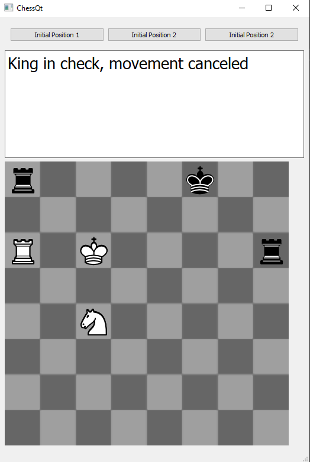

# ChessQt

A chess game prototype writen in c++, using Qt for the UI.

## About the project

This chess prototype includes 3 types of pieces: the king, knight and rook. Basic rules like piece movement and checks are followed, though there is no win or lose event when a checkmate occurs. 

Unit tests are written using [Google test](https://google.github.io/googletest/). 

The Ui is made with Qt.

## Running the project

1- Qt5 is needed to run the project. You can install it [here](https://www.qt.io/download-qt-installer?hsCtaTracking=99d9dd4f-5681-48d2-b096-470725510d34%7C074ddad0-fdef-4e53-8aa8-5e8a876d6ab4).

2- Visual Studio 2019 can be used to run the project. Install the Qt Vs tools extension from Visual Studio Marketplace.

3- Open the [solution](EchecsQt.sln) and navigate to Extensions->Qt Vs Tools->Qt Versions. Add your Qt version, with your path to qmake.exe ex: E:\Qt\5.15.0\msvc2019_64\bin\qmake.exe.

4- In the project propreties, navigate to Properties->Qt Project Setting. At Qt Installation, set yout Qt version.

5- Run the project.

## Future work

The first thing that would need to added is the implementation of all pieces, as well as checkmake, draw scenarios like stalemate, dead position, etc. It would also be interesting to add the posibility to use an AI player.
